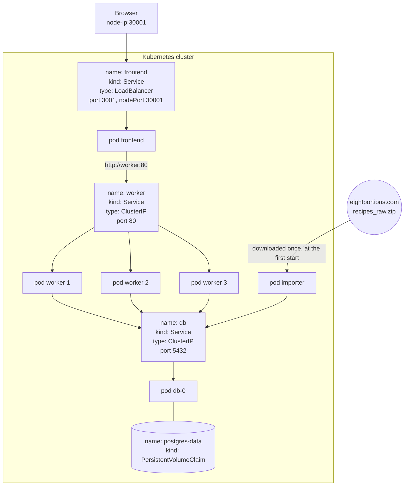

# Description of the software

The software is already deployed on:
https://recipe-finder.timothecormier.fr/

Recipe Finder is a recipe search website. By simply writing a recipe or an ingredient name in the search bar, the website searches a database of 120 000 recipes, so you have plenty of choices for your meal!
An Express frontend sends each search to several FastAPI workers in parallel, which look for matching recipes in a PostgreSQL database.

It uses the recipe dataset from https://eightportions.com/datasets/Recipes/#fn:1

# Software architecture design

| Object                    | Role                                                                                                                                                                                                                                                |
| ------------------------- | ------------------------------------------------------------------------------------------------------------------------------------------------------------------------------------------------------------------------------------------------- |
| Express Frontend          | It sends the clients' requests to the workers, and sends back the web pages they asked for.                                                                                                                                                         |
| FastAPI Worker            | The role of the workers is to search for the key words of the query inside one shard, with the Python library rapidfuzz. We decided to create 12 shards for the 120k recipes, so each time a worker receives a request, it only goes through a set of 10k recipes. |
| PostgreSQL                | It is our database; it stores all the recipes in one table (title, ingredients, instructions).                                                                                                                                                      |
| Importer (job)            | It runs only once, until it succeeds. Its role is to fill the database with the 120k recipes, and it stops once they are all imported.                                                                                                              |
| ConfigMap                 | We use a ConfigMap to store the variables that are not secret.                                                                                                                                                                                      |
| Secret                    | We use a Secret for the database password.                                                                                                                                                                                                          |

# Benefits and challenges of our architecture design

## Security

The only pod that is reachable from outside the cluster is the Express frontend: the workers and the database use a ClusterIP service, so they only exist inside the cluster and nobody can query them directly. 
We are also safe against SQL injection because we never build a query by hand with the text typed by the user: SQLModel and psycopg2 send the values as parameters, so they can never be executed as SQL.

## Next implementations and modifications

### Performance
- We can also modify the way the database gives the shards to the workers, so it takes less time. With the current implementation, the PostgreSQL pod has to read the whole database for each worker that asks for its own shard. The best case would be the pod reading only the lines of that shard, which we could do with a shard column and an index on it.
- We can replicate our frontend, because we are not using websockets so it is easier to replicate. And we already have the LoadBalancer in the Kubernetes files.
- We could add other workers to divide the work more and run more tasks in parallel. However, their number cannot be multiplied without any consequence. Adding 2 or 3 more workers may indeed improve the search speed, but adding 50 more would produce the exact opposite. This is due to the database problem mentioned before, and to the number of CPU cores of the machine. To optimize the performance, the search time should be measured for each number of workers and compared, and we would keep the number that gives the shortest search time.
- Docker does not split the requests evenly. With 12 requests, the workers do not receive 4 requests each, it is more like 4, 3 and 5. To get a real 4, 4, 4 distribution, we would have to send the requests directly to worker1, worker2 and worker3, but this is not the approach we chose here, because we would no longer use the ClusterIP service to talk to the workers, so it would no longer be dynamic.

### User experience
- We can add better CSS styles to make the website nicer.
- We can add buttons and REST endpoints to add and edit recipes.
- We can add a header and a footer.

### Dataset auto importation

We use the importer pod at the first start of the database, and it downloads the dataset from https://eightportions.com/recipes_raw.zip (the page in question is https://eightportions.com/datasets/Recipes/#fn:1). So if that website is down, the importer pod cannot download the dataset and cannot fill the database. An idea could be to save the 3 JSON files inside the importer image that we push to Docker Hub. But in that case we could also drop the importer pod completely and put the 3 JSON files directly in the worker image, and the first worker that starts would be the one initializing the database.
